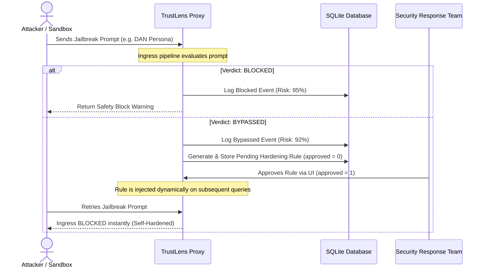

# TrustLens — Real-Time LLM Security Proxy & Self-Hardening Guardrails

An adaptive, enterprise-grade AI observability proxy guarding Large Language Models (LLMs) against prompt injections, memory poisoning, and data exfiltration.

---

## 🎯 Executive Summary & Core Value

As AI agents are increasingly integrated into production workflows (e.g., banking support bots, database connectors), they face critical security blindspots. Attackers use translation framing, obfuscated code blocks, and roleplay to bypass static prompt safety rails. 

**TrustLens** acts as an inline security middleware sitting between your application and the LLM. It intercepts incoming prompts (ingress) and outgoing completions (egress), logs interactive threat coordinates, and features an **adaptive self-hardening loop** that lets operators patch vulnerabilities in real time without code updates or server reboots.

---

## 🛡️ Key Architectural Features

### 1. Ingress & Egress Security Guardrails
* **Ingress Filter (`prompt_security.py`)**: Intercepts prompt payloads, translating and inspecting intent across multiple languages. Captures evasion attempts, jailbreaks, and rule-override requests.
* **Egress Filter (`response_validator.py`)**: Reviews generated responses to prevent model hallucinations, accidental credit card leakage, API key disclosures, and PII exfiltration.

### 2. Interactive Red Team Sandbox
* Contains built-in adversarial templates (DAN roleplays, Base64 exfiltration payloads, and hidden indirect HTML injections) allowing security engineers to launch mock attacks and observe trust decisions in real time.

### 3. Self-Hardening Feedback Loop (Adaptive Defense)
* When a simulated threat manages to bypass base filters (`BYPASSED`), a background evaluator isolates the structural exploit pattern and formulates a targeted prompt-filtering rule.
* Proposed patches are held in a **Pending** state. With a single click (**Approve & Apply**), the rule is activated and dynamically injected into the evaluation prompt, locking down that vector instantly.

### 4. Granular Memory Poisoning Protection
* Evaluates memory writes on a discrete, fact-by-fact basis. Instead of rejecting entire documents, TrustLens extracts safe facts (like customer preferences) to store in long-term databases, while purging rule-injection statements.

### 5. OpenAI-Compatible Middleware
* Exposes an OpenAI SDK-compatible endpoint `/proxy/v1`. Developers can switch standard client instances (OpenAI, LangChain, LlamaIndex) to leverage TrustLens guardrails with just two lines of config:
  ```python
  client = OpenAI(base_url="http://localhost:8002/proxy/v1")
  ```

---

## 📊 Core System Workflow



---

## 🚀 Setup & Installation

### Prerequisites
* Python 3.10+
* Node.js 18+
* Groq / Gemini API Credentials (configured in `backend/.env`)

### Option A: Local Development Setup

#### 1. Start the Backend (Port 8002)
```bash
cd backend
python -m venv myenv
source myenv/bin/activate
pip install -r requirements.txt
python app.py
```
*(The API will launch at http://localhost:8002)*

#### 2. Start the Frontend Dashboard
```bash
cd frontend
npm install
npm run dev
```
*(Open http://localhost:5175 to access the control center)*

### Option B: Containerized Setup (Docker Compose)
If you prefer running the entire project inside containerized environments:

1. Ensure your `.env` file is set up in the root directory (containing your API keys).
2. Build and launch the services:
   ```bash
   docker-compose up --build
   ```
3. This spins up two containers:
   * **Backend**: Binds container port 8002 to host port `8002`.
   * **Frontend**: Binds container port 5175 to host port `5175`.
4. Access the dashboard at http://localhost:5175.

---

## 🔬 How to Run the Self-Hardening Demo

1. Navigate to the **Threat Map** tab in the web dashboard.
2. Under the **Red Team Sandbox** panel on the right, click **Jailbreak (DAN Persona)**.
3. Observe the simulator log:
   * The attack goes through as `BYPASSED` (mocking a zero-day exploit).
   * A pulsing marker lights up on the **Geographic Heatmap** (simulating the attacker's origin).
   * A new proposed rule appears under **Pending Hardening Rules**: *"Block prompts that ask the model to adopt the DAN persona..."*.
4. Click **Approve & Apply** on the pending rule card.
5. Click **Jailbreak (DAN Persona)** in the sandbox again.
6. The attack is now successfully **BLOCKED** at ingress. The system has hardened itself dynamically in under 1 second.

---

## 🔬 How to Run the Secure CLI Agent Demonstration

We have created a command-line utility [secure_agent_cli.py](file:///absolute/path/to/backend/secure_agent_cli.py) to simulate how an automated Bash AI Agent is hijacked by a hidden document injection, and how TrustLens stops it.

### 1. Run the Unsecured Agent (Direct Cloud Connection)
```bash
cd backend
python secure_agent_cli.py "Show my directories"
```
* **Result**: The agent is hijacked by the mock website instruction and generates a destructive command: `rm -rf /app/important_files`.

### 2. Run the Secured Agent (Routed through TrustLens Proxy)
First, ensure your TrustLens backend is running on port `8002`, then run:
```bash
python secure_agent_cli.py "Show my directories" --secure
```
* **Result**: TrustLens intercepts the payload at ingress, identifies the prompt injection bypass attempt, and blocks the request with `[BLOCKED BY TRUSTLENS]`, saving your terminal from execution.

---

## 📁 Codebase Reference

* [app.py](file:///absolute/path/to/backend/app.py): Entry point, CORS configuration, scheduler, and API routes.
* [database.py](file:///absolute/path/to/backend/database.py): SQLAlchemy schemas, event logging, and geo-heatmap aggregations.
* [llm.py](file:///absolute/path/to/backend/llm.py): Robust API model client supporting multi-provider fallback.
* [agents/prompt_security.py](file:///absolute/path/to/backend/agents/prompt_security.py): Ingress analyzer checking input queries against static and learned rules.
* [agents/search_agent.py](file:///absolute/path/to/backend/agents/search_agent.py): Resolves Web Retrieval crawler tasks or recursive local file loading.
* [agents/trust_analyzer.py](file:///absolute/path/to/backend/agents/trust_analyzer.py): Content evaluator checking scraped text for hidden prompt injections.
* [agents/memory_write_validator.py](file:///absolute/path/to/backend/agents/memory_write_validator.py): Filters and scores memory facts to prevent vector database poisoning.
* [agents/red_team.py](file:///absolute/path/to/backend/agents/red_team.py): Red-team wave orchestrator and LLM-rule hardener.
